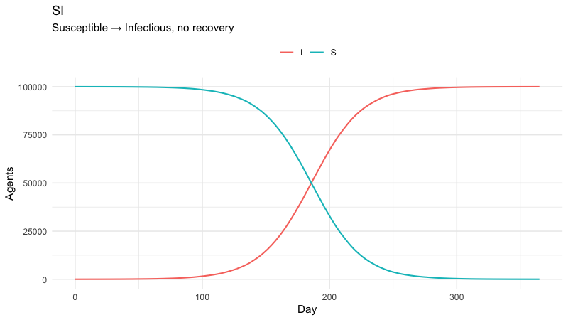
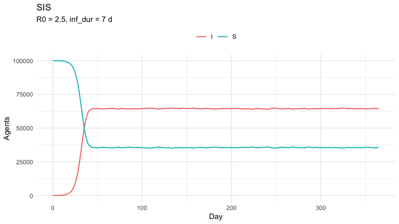
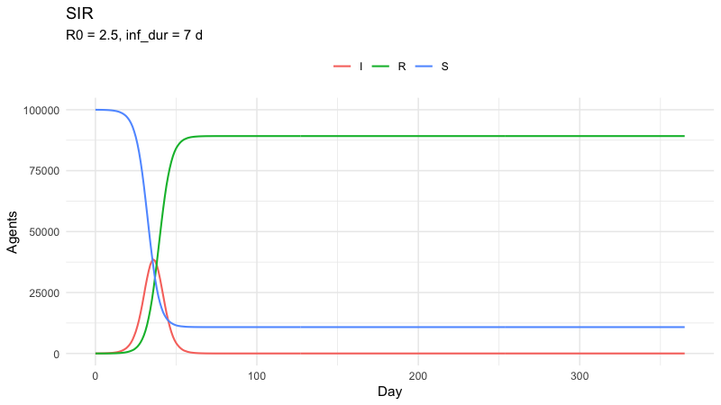
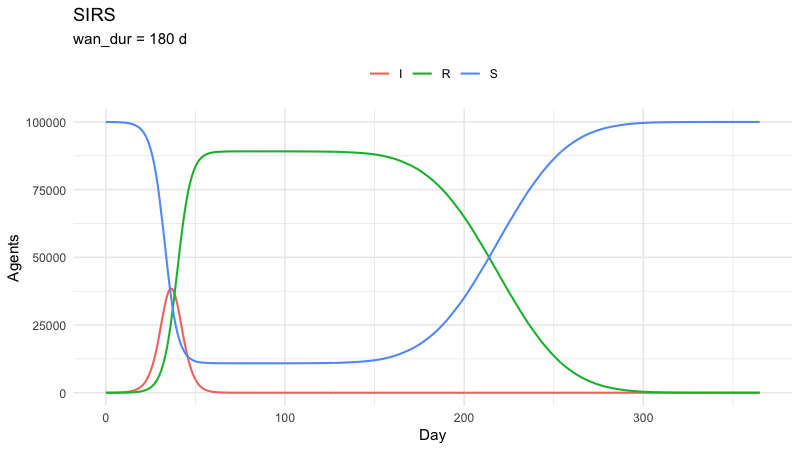
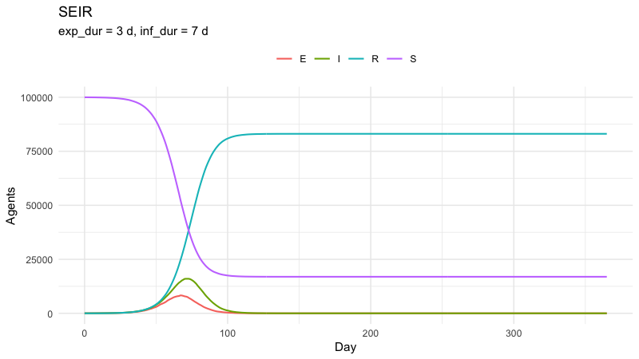
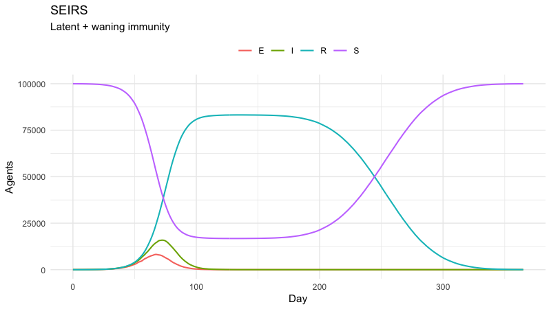

laser-generic disease models from R
================
laser-generic tutorials
2026-06-23

- [Setup](#setup)
- [SI — simple infection, no
  recovery](#si--simple-infection-no-recovery)
- [SIS — recover and return to
  susceptible](#sis--recover-and-return-to-susceptible)
- [SIR — permanent immunity after
  recovery](#sir--permanent-immunity-after-recovery)
- [SIRS — waning immunity](#sirs--waning-immunity)
- [SEIR — adds a latent (exposed)
  period](#seir--adds-a-latent-exposed-period)
- [SEIRS — SEIR plus waning immunity](#seirs--seir-plus-waning-immunity)
- [What’s next](#whats-next)

This tutorial drives the
[`laser-generic`](https://pypi.org/project/laser-generic/) Python
package from R using
[`reticulate`](https://rstudio.github.io/reticulate/). Each section sets
up and runs one of the six standard disease models in `laser.generic`,
then plots its compartment trajectories.

Requires **R ≥ 4.1**. The first knit will be slow while `reticulate`
fetches `laser-generic` from PyPI; subsequent knits reuse the cached
environment.

## Setup

``` r
library(reticulate)
library(ggplot2)
```

Declare the Python dependencies. `reticulate::py_require()` provisions
an ephemeral, cached environment on demand — no manual `pip install`
needed.

``` r
py_require(c("laser-generic", "numpy"))
```

Load the shared helpers (scenario factory, plotting, etc.):

``` r
source("helpers.R")
setup_python()
```

A compact wrapper that does the boilerplate every model needs. Each
disease section below just supplies its own `components` list and reads
back the trajectories.

``` r
run_model <- function(parameters_list, scenario, components_fn) {
    parameters <- PropertySet(reticulate::dict(parameters_list))
    model <- lg()$Model(scenario, parameters)
    model$components <- components_fn(model)
    model$run()
    model
}
```

A small dial of common knobs we’ll reuse:

``` r
NTICKS    <- 365L * 1L     # one year
POP       <- 100000L       # single-node population
INIT_INF  <- 10L           # initial infections
R0        <- 2.5           # basic reproduction number for SIR/SEIR-style sims
INF_DUR   <- 7             # mean infectious days
EXP_DUR   <- 3             # mean exposed days (SEIR / SEIRS)
WAN_DUR   <- 180           # mean waning days (SIRS / SEIRS)
BETA      <- R0 / INF_DUR  # per-day transmission rate
```

## SI — simple infection, no recovery

The classic logistic-growth model: every susceptible eventually becomes
infected. Has only β (no recovery rate).

``` r
seed_everything()

scenario <- make_scenario(pop = POP)
scenario["S"] <- POP - INIT_INF
scenario["I"] <- INIT_INF

SI <- lg()$SI

model <- run_model(
    parameters_list = list(prng_seed = 1L, nticks = NTICKS, beta = 0.05),
    scenario        = scenario,
    components_fn   = function(m) list(
        SI$Susceptible(m),
        SI$Infectious(m),
        SI$Transmission(m)
    )
)

compartments_df(model, c("S", "I")) |>
    plot_compartments(title = "SI", subtitle = "Susceptible → Infectious, no recovery")
```

<!-- -->

## SIS — recover and return to susceptible

Recovery is permanent for the agent’s *current* infection but doesn’t
confer immunity. Settles into an endemic equilibrium driven by the
balance between transmission and recovery.

``` r
seed_everything()

scenario <- make_scenario(pop = POP)
scenario["S"] <- POP - INIT_INF
scenario["I"] <- INIT_INF

SIS <- lg()$SIS
infdurdist <- .lg_env$laser_dist$normal(loc = INF_DUR, scale = 1.5)

model <- run_model(
    parameters_list = list(prng_seed = 2L, nticks = NTICKS, beta = BETA),
    scenario        = scenario,
    components_fn   = function(m) list(
        SIS$Susceptible(m),
        SIS$Infectious(m, infdurdist),
        SIS$Transmission(m, infdurdist)
    )
)

compartments_df(model, c("S", "I")) |>
    plot_compartments(title = "SIS", subtitle = sprintf("R0 = %g, inf_dur = %g d", R0, INF_DUR))
```

<!-- -->

## SIR — permanent immunity after recovery

Once recovered, agents leave the susceptible pool entirely. Produces the
classic epidemic curve that exhausts itself once enough of the
population is immune.

``` r
seed_everything()

scenario <- make_scenario(pop = POP)
scenario["S"] <- POP - INIT_INF
scenario["I"] <- INIT_INF
scenario["R"] <- 0L

SIR <- lg()$SIR
infdurdist <- .lg_env$laser_dist$normal(loc = INF_DUR, scale = 1.5)

model <- run_model(
    parameters_list = list(prng_seed = 3L, nticks = NTICKS, beta = BETA),
    scenario        = scenario,
    components_fn   = function(m) list(
        SIR$Susceptible(m),
        SIR$Infectious(m, infdurdist),
        SIR$Recovered(m),
        SIR$Transmission(m, infdurdist)
    )
)

compartments_df(model, c("S", "I", "R")) |>
    plot_compartments(title = "SIR", subtitle = sprintf("R0 = %g, inf_dur = %g d", R0, INF_DUR))
```

<!-- -->

## SIRS — waning immunity

Recovered agents return to susceptible after a (sampled) waning period.
Produces recurring waves rather than a single epidemic.

``` r
seed_everything()

scenario <- make_scenario(pop = POP)
scenario["S"] <- POP - INIT_INF
scenario["I"] <- INIT_INF
scenario["R"] <- 0L

SIRS <- lg()$SIRS
infdurdist <- .lg_env$laser_dist$normal(loc = INF_DUR, scale = 1.5)
wandurdist <- .lg_env$laser_dist$normal(loc = WAN_DUR, scale = 30)

model <- run_model(
    parameters_list = list(prng_seed = 4L, nticks = NTICKS, beta = BETA),
    scenario        = scenario,
    components_fn   = function(m) list(
        SIRS$Susceptible(m),
        SIRS$Infectious(m, infdurdist, wandurdist),
        SIRS$Recovered(m, wandurdist),
        SIRS$Transmission(m, infdurdist)
    )
)

compartments_df(model, c("S", "I", "R")) |>
    plot_compartments(title = "SIRS", subtitle = sprintf("wan_dur = %g d", WAN_DUR))
```

<!-- -->

## SEIR — adds a latent (exposed) period

The exposed compartment holds individuals who are infected but not yet
infectious. Delays the epidemic onset compared to SIR for the same R0.

``` r
seed_everything()

scenario <- make_scenario(pop = POP)
scenario["S"] <- POP - INIT_INF
scenario["E"] <- 0L
scenario["I"] <- INIT_INF
scenario["R"] <- 0L

SEIR <- lg()$SEIR
expdurdist <- .lg_env$laser_dist$normal(loc = EXP_DUR, scale = 1.0)
infdurdist <- .lg_env$laser_dist$normal(loc = INF_DUR, scale = 1.5)

model <- run_model(
    parameters_list = list(prng_seed = 5L, nticks = NTICKS, beta = BETA),
    scenario        = scenario,
    components_fn   = function(m) list(
        SEIR$Susceptible(m),
        SEIR$Exposed(m, expdurdist, infdurdist),
        SEIR$Infectious(m, infdurdist),
        SEIR$Recovered(m),
        SEIR$Transmission(m, expdurdist)
    )
)

compartments_df(model, c("S", "E", "I", "R")) |>
    plot_compartments(title = "SEIR", subtitle = sprintf("exp_dur = %g d, inf_dur = %g d", EXP_DUR, INF_DUR))
```

<!-- -->

## SEIRS — SEIR plus waning immunity

Combines a latent period with waning immunity. The closest of these six
to a realistic measles-style model (modulo demography, which we cover in
`02-customization.Rmd`).

``` r
seed_everything()

scenario <- make_scenario(pop = POP)
scenario["S"] <- POP - INIT_INF
scenario["E"] <- 0L
scenario["I"] <- INIT_INF
scenario["R"] <- 0L

SEIRS <- lg()$SEIRS
expdurdist <- .lg_env$laser_dist$normal(loc = EXP_DUR, scale = 1.0)
infdurdist <- .lg_env$laser_dist$normal(loc = INF_DUR, scale = 1.5)
wandurdist <- .lg_env$laser_dist$normal(loc = WAN_DUR, scale = 30)

model <- run_model(
    parameters_list = list(prng_seed = 6L, nticks = NTICKS, beta = BETA),
    scenario        = scenario,
    components_fn   = function(m) list(
        SEIRS$Susceptible(m),
        SEIRS$Exposed(m, expdurdist, infdurdist),
        SEIRS$Infectious(m, infdurdist, wandurdist),
        SEIRS$Recovered(m, wandurdist),
        SEIRS$Transmission(m, expdurdist)
    )
)

compartments_df(model, c("S", "E", "I", "R")) |>
    plot_compartments(title = "SEIRS", subtitle = "Latent + waning immunity")
```

<!-- -->

## What’s next

- **Demography.** None of the above include births or deaths. See
  `02-customization.Rmd` for examples of adding `BirthsByCBR`,
  `MortalityByCDR`, `MortalityByEstimator`, and
  `ConstantPopVitalDynamics` to an SEIR base model.
- **Spatial structure.** Every example here uses a single node
  (`M = 1, N = 1`). Pass larger `M` / `N` to `make_scenario()` and a
  per-node population vector to drive a grid; the same component list
  works without modification.
- **Distributions other than `constant()`.** `laser.core.distributions`
  also exposes `normal()`, `lognormal()`, `exponential()`, etc. — swap
  them in for any of the `*durdist` arguments above.
