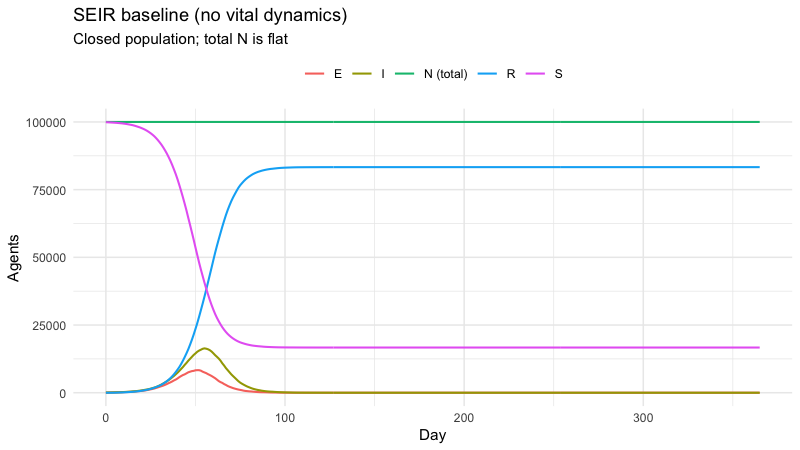
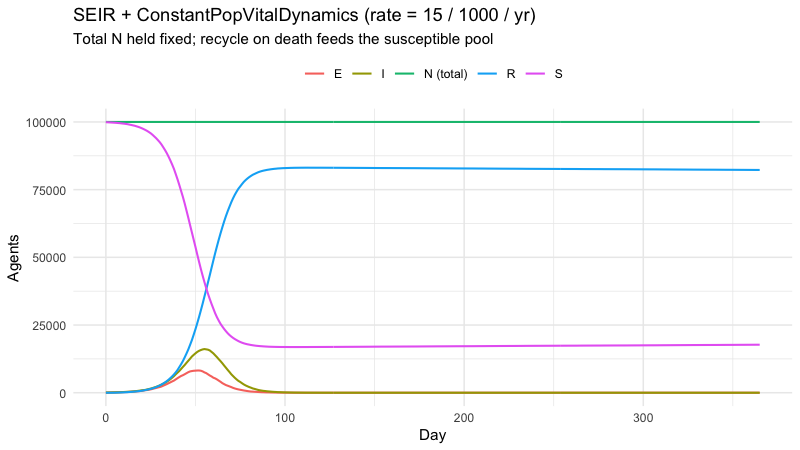
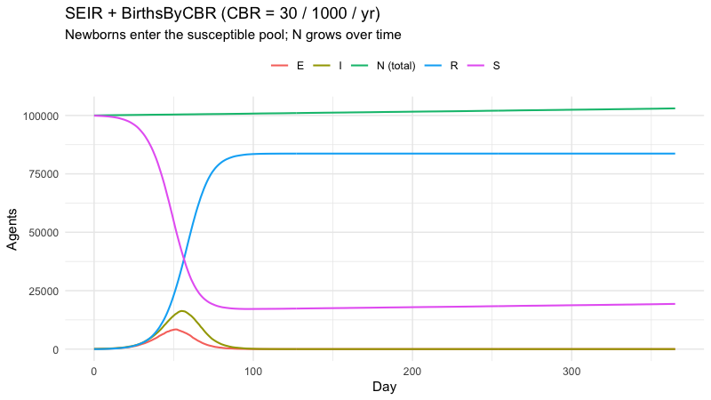
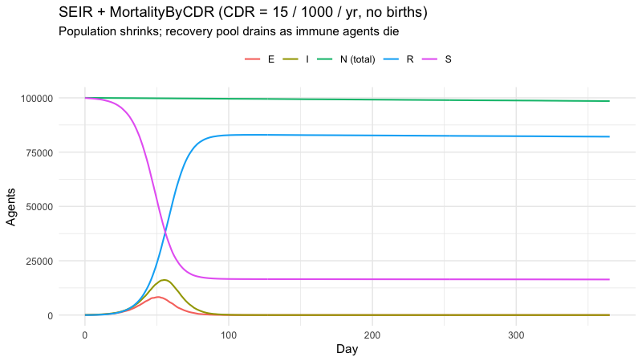
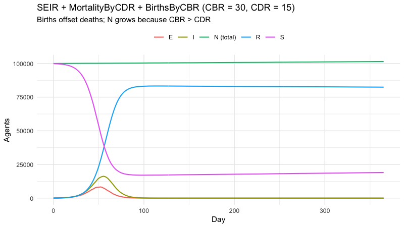
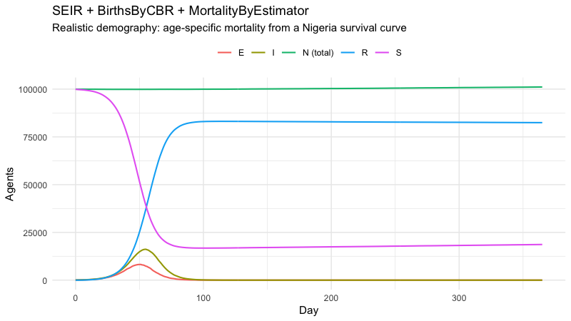
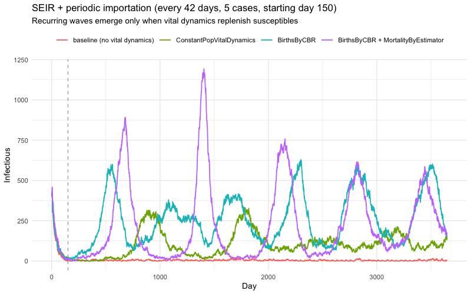

Customizing laser-generic models: adding vital dynamics
================
laser-generic tutorials
2026-06-23

- [Setup](#setup)
- [Common SEIR base](#common-seir-base)
- [Baseline — no vital dynamics](#baseline--no-vital-dynamics)
- [Adding `ConstantPopVitalDynamics`](#adding-constantpopvitaldynamics)
- [Adding `BirthsByCBR`](#adding-birthsbycbr)
- [Adding `MortalityByCDR`](#adding-mortalitybycdr)
- [Adding `MortalityByEstimator`](#adding-mortalitybyestimator)
- [Periodic importation — keeping the disease
  alive](#periodic-importation--keeping-the-disease-alive)
  - [A bring-your-own component](#a-bring-your-own-component)
  - [Four scenarios, one comparison](#four-scenarios-one-comparison)
- [Choosing between the components](#choosing-between-the-components)
- [What’s next](#whats-next)

This tutorial builds on `01-models.Rmd`. We start with a baseline SEIR
model and progressively layer in the four vital-dynamics components from
`laser.generic.vitaldynamics`:

| Component | What it adds |
|----|----|
| `ConstantPopVitalDynamics` | Deaths that immediately recycle into newborn agents — population stays exactly constant. |
| `BirthsByCBR` | Per-tick Poisson births driven by a crude birth rate and an age pyramid. Population grows. |
| `MortalityByCDR` | Per-tick mortality driven by a crude death rate. Population shrinks unless paired with births. |
| `MortalityByEstimator` | Age-specific mortality sampled from a survival curve (Kaplan-Meier). Realistic demography. |

Requires **R ≥ 4.1**. See `README.md` for setup.

## Setup

``` r
library(reticulate)
library(ggplot2)
```

``` r
py_require(c("laser-generic", "numpy"))
```

``` r
source("helpers.R")
setup_python()
```

A small utility that adds a total-population trajectory on top of
`compartments_df()`:

``` r
totals_df <- function(model, states) {
    df <- compartments_df(model, states)
    totals <- aggregate(count ~ tick, data = df, sum)
    totals$compartment <- "N (total)"
    rbind(df, totals)
}
```

## Common SEIR base

We’ll keep the disease parameters fixed across every example so the
contribution of each demographic component is the only thing changing.
Five-year run so vital dynamics have time to matter.

``` r
NTICKS    <- 365L * 1L      # one year
POP       <- 100000L
INIT_INF  <- 100L
INIT_EXP  <- 0L
INIT_REC  <- 0L
R0        <- 2.5
INF_DUR   <- 7
EXP_DUR   <- 3
BETA      <- R0 / INF_DUR

# The four vital-dynamics components share these rate inputs.
CBR       <- 30.0   # crude birth rate, per 1000 per year (Nigeria-ish)
CDR       <- 15.0   # crude death rate, per 1000 per year
```

A factory for the scenario + parameter set — every section calls this so
the only thing that changes between examples is the components list.

``` r
make_seir <- function(birthrates_arg = NULL,
                     nticks = NTICKS,
                     pop    = POP,
                     beta   = BETA,
                     init_e = INIT_EXP,
                     init_i = INIT_INF,
                     init_r = INIT_REC,
                     init_s = NULL) {
    if (is.null(init_s)) init_s <- pop - init_e - init_i - init_r
    scenario <- make_scenario(pop = pop)
    scenario["S"] <- init_s
    scenario["E"] <- init_e
    scenario["I"] <- init_i
    scenario["R"] <- init_r

    parameters <- PropertySet(reticulate::dict(list(
        prng_seed = 7L, nticks = as.integer(nticks), beta = beta
    )))

    # `birthrates` must be passed to Model() up-front so it can size capacity
    # for incoming births. If no births, pass NULL.
    if (is.null(birthrates_arg)) {
        model <- lg()$Model(scenario, parameters)
    } else {
        model <- lg()$Model(scenario, parameters, birthrates = birthrates_arg)
    }
    model
}

seir_components <- function(model) {
    SEIR <- lg()$SEIR
    expdurdist <- .lg_env$laser_dist$normal(loc = EXP_DUR, scale = 1.0)
    infdurdist <- .lg_env$laser_dist$normal(loc = INF_DUR, scale = 1.5)
    list(
        SEIR$Susceptible(model),
        SEIR$Exposed(model, expdurdist, infdurdist),
        SEIR$Infectious(model, infdurdist),
        SEIR$Recovered(model),
        SEIR$Transmission(model, expdurdist)
    )
}
```

The Nigeria age pyramid and survival curve we’ll need for the births and
age-specific-mortality examples:

``` r
age_data <- read.csv(
    "../notebooks/data/Nigeria-Distribution-2020.csv",
    header = FALSE
)
age_pyramid_yearly <- as.numeric(age_data[1:89, 1])
pyramid <- .lg_env$laser_demog$AliasedDistribution(np()$asarray(age_pyramid_yearly))

survival_raw <- read.csv(
    "../notebooks/data/Nigeria-Survival-2020.csv",
    header = FALSE
)
survival_cdf <- cumsum(as.numeric(survival_raw[1:89, 2]))
survival_estimator <- .lg_env$laser_demog$KaplanMeierEstimator(
    np()$asarray(survival_cdf)
)
```

## Baseline — no vital dynamics

A closed-population SEIR. The total `N` line is flat because nobody
enters or leaves the population.

``` r
seed_everything()

model <- make_seir()
model$components <- seir_components(model)
model$run()
```

    ## None

``` r
totals_df(model, c("S", "E", "I", "R")) |>
    plot_compartments(
        title    = "SEIR baseline (no vital dynamics)",
        subtitle = "Closed population; total N is flat"
    )
```

<!-- -->

## Adding `ConstantPopVitalDynamics`

Recycles deceased agents into newborns at the specified rate (per 1000
per year), keeping total population exactly constant. Useful when you
care about birth-cohort flow but want to avoid sizing capacity for
indefinite growth.

``` r
seed_everything()

recycle_rates <- ValuesMap()$from_scalar(CDR, as.integer(NTICKS), 1L)

model <- make_seir()
model$components <- c(
    seir_components(model),
    list(.lg_env$laser_vd$ConstantPopVitalDynamics(model, recycle_rates, dobs = TRUE))
)
model$run()
```

    ## None

``` r
totals_df(model, c("S", "E", "I", "R")) |>
    plot_compartments(
        title    = sprintf("SEIR + ConstantPopVitalDynamics (rate = %g / 1000 / yr)", CDR),
        subtitle = "Total N held fixed; recycle on death feeds the susceptible pool"
    )
```

<!-- -->

## Adding `BirthsByCBR`

Adds Poisson-distributed newborns each tick driven by a crude birth
rate. With no offsetting mortality, the population grows.

`BirthsByCBR` must come last in the component list so the rest of the
tick is computed against today’s population, not after the newborns have
joined.

``` r
seed_everything()

birthrates <- ValuesMap()$from_scalar(CBR, as.integer(NTICKS), 1L)

model <- make_seir(birthrates_arg = birthrates)
model$components <- c(
    seir_components(model),
    list(.lg_env$laser_vd$BirthsByCBR(model, birthrates, pyramid, track = TRUE))
)
model$run()
```

    ## None

``` r
totals_df(model, c("S", "E", "I", "R")) |>
    plot_compartments(
        title    = sprintf("SEIR + BirthsByCBR (CBR = %g / 1000 / yr)", CBR),
        subtitle = "Newborns enter the susceptible pool; N grows over time"
    )
```

<!-- -->

## Adding `MortalityByCDR`

Per-tick mortality risk applied uniformly across the population. Pair
with `BirthsByCBR` for a realistic demography baseline.

First, mortality alone (no births) — the population shrinks:

``` r
seed_everything()

mortality_rates <- ValuesMap()$from_scalar(CDR, as.integer(NTICKS), 1L)

model <- make_seir()
model$components <- c(
    seir_components(model),
    list(.lg_env$laser_vd$MortalityByCDR(model, mortality_rates))
)
model$run()
```

    ## None

``` r
totals_df(model, c("S", "E", "I", "R")) |>
    plot_compartments(
        title    = sprintf("SEIR + MortalityByCDR (CDR = %g / 1000 / yr, no births)", CDR),
        subtitle = "Population shrinks; recovery pool drains as immune agents die"
    )
```

<!-- -->

Now with births balancing deaths:

``` r
seed_everything()

birthrates      <- ValuesMap()$from_scalar(CBR, as.integer(NTICKS), 1L)
mortality_rates <- ValuesMap()$from_scalar(CDR, as.integer(NTICKS), 1L)

model <- make_seir(birthrates_arg = birthrates)
model$components <- c(
    seir_components(model),
    list(
        .lg_env$laser_vd$MortalityByCDR(model, mortality_rates),
        .lg_env$laser_vd$BirthsByCBR(model, birthrates, pyramid, track = TRUE)
    )
)
model$run()
```

    ## None

``` r
totals_df(model, c("S", "E", "I", "R")) |>
    plot_compartments(
        title    = sprintf("SEIR + MortalityByCDR + BirthsByCBR (CBR = %g, CDR = %g)", CBR, CDR),
        subtitle = "Births offset deaths; N grows because CBR > CDR"
    )
```

<!-- -->

## Adding `MortalityByEstimator`

Age-specific mortality sampled from a Kaplan-Meier survival curve.
Unlike `MortalityByCDR` (uniform per-tick risk), this draws each agent’s
date of death from the survival distribution conditional on their date
of birth — which means `BirthsByCBR` must be present with `track = TRUE`
so newborns have a recorded `dob`.

``` r
seed_everything()

birthrates <- ValuesMap()$from_scalar(CBR, as.integer(NTICKS), 1L)

model <- make_seir(birthrates_arg = birthrates)
model$components <- c(
    seir_components(model),
    list(
        .lg_env$laser_vd$BirthsByCBR(model, birthrates, pyramid, track = TRUE),
        .lg_env$laser_vd$MortalityByEstimator(model, survival_estimator)
    )
)
model$run()
```

    ## None

``` r
totals_df(model, c("S", "E", "I", "R")) |>
    plot_compartments(
        title    = "SEIR + BirthsByCBR + MortalityByEstimator",
        subtitle = "Realistic demography: age-specific mortality from a Nigeria survival curve"
    )
```

<!-- -->

## Periodic importation — keeping the disease alive

Without external reintroduction, an SEIR outbreak burns through every
available susceptible and dies out. Real diseases see recurring waves
because (a) the susceptible pool is replenished by births (and, in
models with waning, by `R → S` transitions) and (b) the pathogen keeps
being reintroduced from outside the population.

We’ll add a small custom component that imports a few random new
infections every two months, then re-run the demographic setups above
side-by-side. The differences make plain *what each vital-dynamics
component actually buys you* over the long term.

### A bring-your-own component

`laser.generic.importation` already ships `Infect_Random_Agents`, but it
exposes a `__call__(model, tick)` interface rather than the `step(tick)`
shape that `Model.run()` expects. Writing a tiny adapter (or in this
case a from-scratch component) is the canonical way to plug custom
behavior into a simulation — and the code below doubles as a tutorial on
*how to write a component at all*.

We define the class in Python via `reticulate::py_run_string()` so the R
side can simply construct it like any other component:

``` r
reticulate::py_run_string("
import numpy as np
import laser.core.distributions as dists
from laser.generic.shared import State

class PeriodicImportation:
    '''Inject `count` random new infections every `period` ticks.

    Imported cases skip the Exposed state — they are assumed to have
    incubated elsewhere and arrive already infectious, matching how
    real importation events are typically modeled.
    '''
    def __init__(self, model, period, count, infdurdist,
                 infdurmin=1, start=0, end=None):
        self.model = model
        self.period = int(period)
        self.count = int(count)
        self.infdurdist = infdurdist
        self.infdurmin = int(infdurmin)
        self.start = int(start)
        self.end = int(end if end is not None else model.params.nticks)

    def step(self, tick):
        if tick < self.start or tick >= self.end:
            return
        if (tick - self.start) % self.period != 0:
            return

        people = self.model.people
        nodes  = self.model.nodes
        susceptible = np.nonzero(people.state == State.SUSCEPTIBLE.value)[0]
        if len(susceptible) == 0:
            return

        n = min(self.count, len(susceptible))
        chosen = np.random.choice(susceptible, size=n, replace=False)
        people.state[chosen] = State.INFECTIOUS.value

        # Imported cases get a freshly sampled infectious duration.
        samples = dists.sample_floats(self.infdurdist, np.zeros(n, np.float32))
        samples = np.maximum(np.round(samples), self.infdurmin).astype(
            people.itimer.dtype
        )
        people.itimer[chosen] = samples

        # Bookkeep node-level counts for the next tick.
        inf_by_node = np.bincount(
            people.nodeid[chosen], minlength=nodes.count
        ).astype(nodes.S.dtype)
        nodes.S[tick + 1] -= inf_by_node
        nodes.I[tick + 1] += inf_by_node
")

PeriodicImportation <- reticulate::py$PeriodicImportation
```

### Four scenarios, one comparison

For this section we leave the defaults of the earlier sections and reach
for a setup that actually has the dynamic range to show recurring
outbreaks. Three things change:

1.  **Larger population** (500,000 vs 100,000) — a typical Critical
    Community Size for measles-style dynamics is in the 250-500K range.
    Below that, stochastic die-out dominates and the recurring-wave
    signal vanishes into noise.
2.  **Higher R0** (12 vs 2.5) — within the canonical measles range. With
    a higher transmission threshold, each wave consumes nearly all
    susceptibles, and the trough-to-peak amplitude is large enough to
    read off the plot.
3.  **Endemic-equilibrium initial conditions.** Instead of starting with
    the whole population susceptible and getting a one-time burnout that
    leaves nothing behind, we seed `S ≈ N / R0` and put the rest in `R`,
    matching the steady-state structure of an endemic disease. The
    biennial pattern then shows up from day one rather than emerging
    only after we wait for the system to settle.

Five cases are imported every six weeks (42 days), starting on day 150
so the first wave is fully visible before reintroduction kicks in. The
run extends to **ten years** (`STICKS`) so the recurring structure has
room to develop.

``` r
seed_everything()

STICKS     <- 365L * 10L  # 10 years — long enough to resolve recurring waves
IMP_PERIOD <- 42L         # every six weeks
IMP_COUNT  <- 5L
IMP_START  <- 150L        # let the first wave finish before importing

# Larger population and higher R0 unlock biennial-style measles dynamics;
# the global POP / R0 stay at the values the earlier sections use.
POP_IMP    <- 500000L
R0_IMP     <- 12
BETA_IMP   <- R0_IMP / INF_DUR

# Equilibrium init: S ≈ N / R0, most of the rest already recovered, plus
# a small endemic prevalence (~0.08%) of infectious to seed the dynamics.
INIT_S_IMP <- as.integer(round(POP_IMP / R0_IMP))
INIT_I_IMP <- as.integer(round(POP_IMP * 0.0008))
INIT_R_IMP <- POP_IMP - INIT_S_IMP - INIT_I_IMP

infdurdist     <- .lg_env$laser_dist$normal(loc = INF_DUR, scale = 1.5)
birthrates     <- ValuesMap()$from_scalar(CBR, as.integer(STICKS), 1L)
recycle_rates  <- ValuesMap()$from_scalar(CDR, as.integer(STICKS), 1L)

run_with_importation <- function(extra_components_fn, birthrates_arg = NULL) {
    model <- make_seir(
        birthrates_arg = birthrates_arg,
        nticks         = STICKS,
        pop            = POP_IMP,
        beta           = BETA_IMP,
        init_s         = INIT_S_IMP,
        init_i         = INIT_I_IMP,
        init_r         = INIT_R_IMP
    )
    importation <- PeriodicImportation(
        model      = model,
        period     = IMP_PERIOD,
        count      = IMP_COUNT,
        infdurdist = infdurdist,
        start      = IMP_START
    )
    model$components <- c(
        seir_components(model),
        extra_components_fn(model),
        list(importation)
    )
    model$run()
    compartments_df(model, c("I"))
}

scenarios <- list(
    "baseline (no vital dynamics)" = list(
        extras = function(m) list(),
        births = NULL
    ),
    "ConstantPopVitalDynamics" = list(
        extras = function(m) list(
            .lg_env$laser_vd$ConstantPopVitalDynamics(m, recycle_rates, dobs = TRUE)
        ),
        births = NULL
    ),
    "BirthsByCBR" = list(
        extras = function(m) list(
            .lg_env$laser_vd$BirthsByCBR(m, birthrates, pyramid, track = TRUE)
        ),
        births = birthrates
    ),
    "BirthsByCBR + MortalityByEstimator" = list(
        extras = function(m) list(
            .lg_env$laser_vd$BirthsByCBR(m, birthrates, pyramid, track = TRUE),
            .lg_env$laser_vd$MortalityByEstimator(m, survival_estimator)
        ),
        births = birthrates
    )
)

all_runs <- do.call(rbind, lapply(names(scenarios), function(label) {
    cfg <- scenarios[[label]]
    df  <- run_with_importation(cfg$extras, birthrates_arg = cfg$births)
    df$scenario <- factor(label, levels = names(scenarios))
    df
}))

ggplot(all_runs, aes(tick, count, color = scenario)) +
    geom_vline(xintercept = IMP_START, linetype = "dashed",
               color = "grey50", linewidth = 0.3) +
    geom_line(linewidth = 0.6) +
    labs(
        title    = sprintf(
            "SEIR + periodic importation (every %d days, %d cases, starting day %d)",
            IMP_PERIOD, IMP_COUNT, IMP_START
        ),
        subtitle = "Recurring waves emerge only when vital dynamics replenish susceptibles",
        x = "Day", y = "Infectious", color = NULL
    ) +
    theme_minimal(base_size = 10) +
    theme(legend.position = "top")
```

<!-- -->

What the four lines say:

- **baseline (no vital dynamics).** Without new susceptibles entering
  the population, the initial endemic prevalence damps out and every
  subsequent importation lands on an immune population. The flat zero
  line is the absence of vital dynamics.
- **`ConstantPopVitalDynamics`.** Recycle-on-death continuously feeds
  the susceptible compartment, so importations periodically reignite the
  disease. Waves are stochastic and unevenly spaced because the recycle
  rate (CDR = 15 / 1000 / yr) is lower than the births case below.
- **`BirthsByCBR`.** Births at CBR = 30 / 1000 / yr build the
  susceptible pool roughly twice as fast as `ConstantPop` does. Waves
  arrive at a regular cadence and peak higher because more susceptibles
  accumulate between waves.
- **`BirthsByCBR + MortalityByEstimator`.** Same susceptible inflow, but
  the immune population now ages out via realistic age-specific
  mortality. Recovered adults die and are replaced by susceptible
  newborns at a balance that gives the **cleanest biennial signal** of
  the four — outbreaks at roughly two-year intervals once the system
  reaches its rhythm. This matches the canonical pre-vaccine measles
  pattern.

The dashed grey line marks `IMP_START` so it’s clear which features of
the trajectory are driven by importation versus by the original seeded
prevalence.

## Choosing between the components

A rough guide:

| If you need … | Use |
|----|----|
| The simplest closed-population approximation | nothing (baseline) |
| To keep total population pinned, with cohort turnover | `ConstantPopVitalDynamics` |
| Growth driven by a published CBR | `BirthsByCBR` |
| Uniform mortality, possibly paired with births | `MortalityByCDR` |
| Age-realistic mortality from a survival curve | `BirthsByCBR(track = TRUE)` + `MortalityByEstimator` |

For multi-decade runs with realistic age structure, the
`BirthsByCBR + MortalityByEstimator` pair is the closest to a fielded
demographic model.

## What’s next

- **Multi-node scenarios.** Pass `M > 1` and `N > 1` to
  `make_scenario()` and a vector of populations to drive a grid. The
  vital-dynamics components apply per-node.
- **Time-varying rates.** Each rate input above is a `ValuesMap`. Build
  one with `ValuesMap.from_array(np_array, n_nodes)` to make CBR/CDR
  vary across the simulation horizon.
- **Real survival data.** Substitute another country’s survival curve by
  replacing the `Nigeria-Survival-2020.csv` load.
