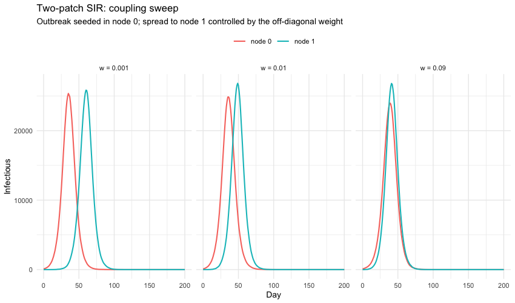
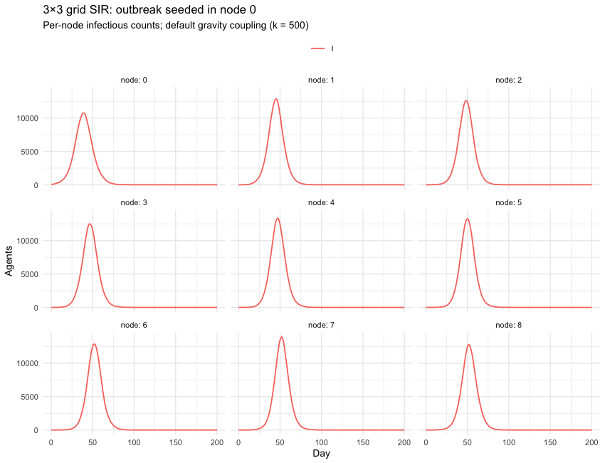
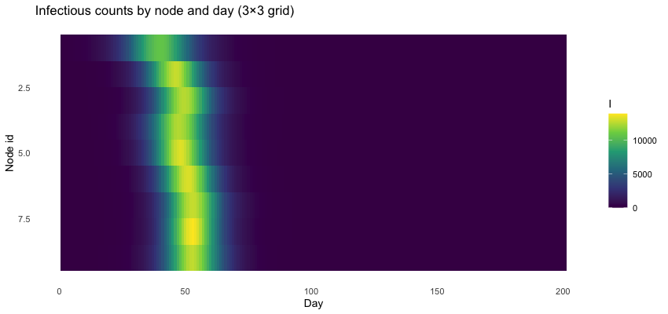
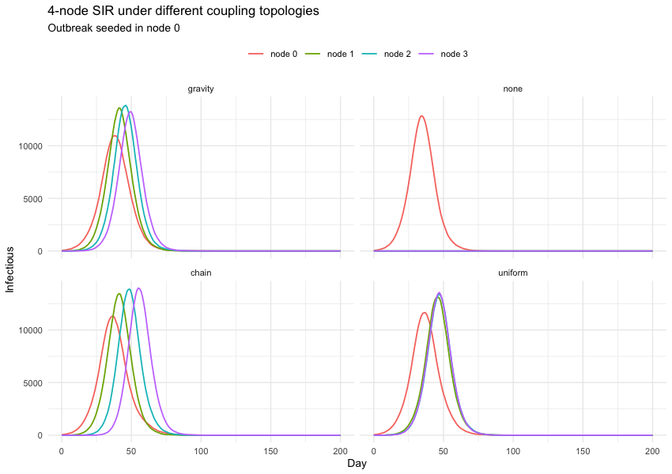
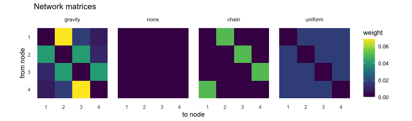

Spatial models with laser-generic
================
laser-generic tutorials
2026-06-23

- [Setup](#setup)
- [Two patches: how coupling controls
  timing](#two-patches-how-coupling-controls-timing)
- [A 3×3 grid: spatial wave from a
  corner](#a-33-grid-spatial-wave-from-a-corner)
- [Custom networks: replace the gravity
  matrix](#custom-networks-replace-the-gravity-matrix)
- [What’s next](#whats-next)

The earlier tutorials all used single-node scenarios. Here we let
populations live in multiple geographic nodes and couple them with a
migration network. `laser.generic` builds a **gravity** network
automatically from each node’s population and centroid coordinates; this
tutorial walks through three concrete uses of that machinery and shows
how to override the network when you want a custom topology.

Requires **R ≥ 4.1**. See `README.md` for setup.

## Setup

``` r
library(reticulate)
library(ggplot2)
```

``` r
py_require(c("laser-generic", "numpy"))
```

``` r
source("helpers.R")
setup_python()
```

A factory that builds an SIR scenario over a grid of nodes and seeds the
disease in a specified node. Used by every example below.

``` r
make_sir <- function(M, N, pop_per_node, seed_node = 0L, n_seed = 100L,
                     nticks = 200L, beta = 2 / 7,
                     params_extra = list()) {

    pops <- rep(as.integer(pop_per_node), M * N)
    scenario <- make_scenario(pop = pops, M = M, N = N)

    # Per-node initial conditions: everyone susceptible, then plant the seed.
    n_nodes <- M * N
    s_init <- pops
    i_init <- rep(0L, n_nodes)
    s_init[seed_node + 1L] <- s_init[seed_node + 1L] - n_seed
    i_init[seed_node + 1L] <- n_seed
    scenario["S"] <- np()$asarray(as.integer(s_init))
    scenario["I"] <- np()$asarray(as.integer(i_init))
    scenario["R"] <- np()$asarray(rep(0L, n_nodes))

    base_params <- list(prng_seed = 11L, nticks = as.integer(nticks), beta = beta)
    parameters <- PropertySet(reticulate::dict(c(base_params, params_extra)))

    model <- lg()$Model(scenario, parameters)

    SIR <- lg()$SIR
    infdurdist <- .lg_env$laser_dist$normal(loc = 7, scale = 1.5)
    model$components <- list(
        SIR$Susceptible(model),
        SIR$Infectious(model, infdurdist),
        SIR$Recovered(model),
        SIR$Transmission(model, infdurdist)
    )
    model
}
```

## Two patches: how coupling controls timing

Two equal-sized populations seeded with 100 infections in node 0. We
compare three coupling strengths by setting `model$network` directly
with off-diagonal weights spanning two orders of magnitude. Higher
weights mean more inter-patch force-of-infection flow, so node 1’s
outbreak catches up to node 0’s faster.

> **Why not just sweep `gravity_k`?** `Model()` always builds the
> network as
> `row_normalizer(gravity(...), max_rowsum = (1/16) + (1/32))`. The
> `row_normalizer` step caps each row sum at ≈0.094 — a hard limit
> that’s intended to keep the per-tick migration fraction physically
> sensible. For populations of this size and node spacing this small,
> the *raw* gravity values blow past the cap for any reasonable `k`, so
> all of `k = 50`, `500`, `5000` produce **identical** normalized
> networks (every row sum lands at exactly 0.09375). To actually sweep
> coupling, we have to bypass the gravity step and set `model$network`
> ourselves.

``` r
seed_everything()

couplings <- c(0.001, 0.01, 0.09)
runs <- lapply(couplings, function(w) {
    model <- make_sir(
        M = 1L, N = 2L,
        pop_per_node = 100000L,
        seed_node    = 0L,
        n_seed       = 100L,
        nticks       = 200L
    )
    # Symmetric inter-patch coupling: each node receives weight w of the
    # other's force-of-infection. Setting model$network here overrides
    # whatever Model() built from gravity + row_normalizer.
    net <- matrix(c(0, w, w, 0), nrow = 2, byrow = TRUE)
    model$network <- np()$asarray(net, dtype = np()$float32)
    model$run()

    df <- compartments_per_node_df(model, c("I"))
    df$coupling <- factor(sprintf("w = %g", w), levels = sprintf("w = %g", couplings))
    df
})
combined <- do.call(rbind, runs)
combined$node_label <- factor(
    paste0("node ", combined$node),
    levels = c("node 0", "node 1")
)

ggplot(combined, aes(tick, count, color = node_label)) +
    geom_line(linewidth = 0.7) +
    facet_wrap(~ coupling, ncol = 3) +
    labs(
        title    = "Two-patch SIR: coupling sweep",
        subtitle = "Outbreak seeded in node 0; spread to node 1 controlled by the off-diagonal weight",
        x = "Day", y = "Infectious", color = NULL
    ) +
    theme_minimal(base_size = 10) +
    theme(legend.position = "top")
```

<!-- -->

Three things to read off the panels above:

- At `w = 0.001` the patches are nearly independent — node 1’s outbreak
  is delayed by weeks and peaks much later than node 0’s.
- At `w = 0.01` coupling is strong enough to seed node 1 within the
  first couple of weeks; the two outbreaks run nearly in parallel with a
  clear but modest lag.
- At `w = 0.09` (essentially at the row-sum cap that `Model()` would
  normally enforce) the two patches behave almost like a single
  well-mixed population.

## A 3×3 grid: spatial wave from a corner

Nine patches arranged in a 3×3 grid, each with 50,000 agents. We seed
the outbreak in the corner node (0) and let the default gravity network
do the rest. The per-node infectious curves show the wave rippling
outward.

``` r
seed_everything()

model <- make_sir(
    M = 3L, N = 3L,
    pop_per_node = 50000L,
    seed_node    = 0L,
    n_seed       = 50L,
    nticks       = 200L
)
model$run()
```

    ## None

``` r
compartments_per_node_df(model, c("I")) |>
    plot_compartments_by_node(
        title    = "3×3 grid SIR: outbreak seeded in node 0",
        subtitle = "Per-node infectious counts; default gravity coupling (k = 500)",
        ncol     = 3
    )
```

<!-- -->

The same data as a node × time heatmap makes the wave easier to see at a
glance:

``` r
I_mat <- reticulate::py_to_r(reticulate::py_get_attr(model$nodes, "I"))
# Heatmap with nodes on the rows and ticks on the columns.
plot_matrix_heatmap(
    t(I_mat),
    title      = "Infectious counts by node and day (3×3 grid)",
    xlab       = "Day",
    ylab       = "Node id",
    fill_label = "I"
)
```

<!-- -->

Reading top-to-bottom: node 0 peaks first, the adjacent grid nodes
follow, and the far-corner node 8 lags the most.

## Custom networks: replace the gravity matrix

`model.network` is an N × N matrix that the `Transmission` components
read every tick. After `Model()` builds the default gravity network you
can replace it with anything you like — handy for studying topology
effects (e.g. a chain or a star) or for plugging in an empirically
calibrated mobility matrix.

We’ll set up the same 4-node scenario four ways: the default gravity,
**no coupling**, a **chain** (node 0 → 1 → 2 → 3 → 0), and **uniform
mixing** (every node touches every other equally).

``` r
seed_everything()

make_4node <- function() {
    make_sir(
        M = 1L, N = 4L,
        pop_per_node = 50000L,
        seed_node    = 0L,
        n_seed       = 50L,
        nticks       = 200L
    )
}

# Helper to overwrite model.network with an R matrix.
set_network <- function(model, mat) {
    stopifnot(nrow(mat) == ncol(mat))
    model$network <- np()$asarray(mat, dtype = np()$float32)
    invisible(model)
}

# 1. Default gravity (whatever Model() built).
m_gravity <- make_4node()
gravity_matrix <- reticulate::py_to_r(m_gravity$network)
m_gravity$run()
```

    ## None

``` r
# 2. No coupling at all — fully diagonal-free zero matrix.
m_none <- make_4node()
set_network(m_none, matrix(0, nrow = 4, ncol = 4))
m_none$run()
```

    ## None

``` r
# 3. Chain topology with wrap-around: each node sends a fraction of its
#    force-of-infection to the next node (modulo 4).
chain_mat <- matrix(0, 4, 4)
fraction  <- 0.05
for (i in 1:4) chain_mat[i, (i %% 4) + 1] <- fraction
m_chain <- make_4node()
set_network(m_chain, chain_mat)
m_chain$run()
```

    ## None

``` r
# 4. Uniform mixing — every off-diagonal entry equal.
uniform_mat <- matrix(fraction / 3, 4, 4)
diag(uniform_mat) <- 0
m_uniform <- make_4node()
set_network(m_uniform, uniform_mat)
m_uniform$run()
```

    ## None

``` r
# Combine and plot infectious trajectories per node.
runs <- list(gravity = m_gravity, none = m_none, chain = m_chain, uniform = m_uniform)
combined <- do.call(rbind, lapply(names(runs), function(label) {
    df <- compartments_per_node_df(runs[[label]], c("I"))
    df$topology <- factor(label, levels = names(runs))
    df
}))
combined$node_label <- factor(paste0("node ", combined$node))

ggplot(combined, aes(tick, count, color = node_label)) +
    geom_line(linewidth = 0.6) +
    facet_wrap(~ topology, ncol = 2) +
    labs(
        title    = "4-node SIR under different coupling topologies",
        subtitle = "Outbreak seeded in node 0",
        x = "Day", y = "Infectious", color = NULL
    ) +
    theme_minimal(base_size = 10) +
    theme(legend.position = "top")
```

<!-- -->

The four panels show distinct spread patterns:

- **gravity** — populations equal, so flows are symmetric; spread is
  roughly synchronous.
- **none** — only node 0 has an outbreak; nodes 1-3 stay flat.
- **chain** — disease ripples 0 → 1 → 2 → 3 with visible lag at each
  hop.
- **uniform** — every off-source node receives identical pressure, so
  their outbreaks fire together.

The actual network matrices, side by side, make the structure clear:

``` r
mats <- list(
    gravity = gravity_matrix,
    none    = matrix(0, 4, 4),
    chain   = chain_mat,
    uniform = uniform_mat
)

plot_list <- lapply(names(mats), function(label) {
    plot_matrix_heatmap(
        mats[[label]],
        title      = label,
        xlab       = "to",
        ylab       = "from",
        fill_label = "weight"
    ) + ggplot2::theme(legend.position = "none")
})

# Cheap side-by-side layout without pulling in patchwork.
grid_df <- do.call(rbind, lapply(seq_along(plot_list), function(i) {
    mat <- mats[[i]]
    df  <- expand.grid(from = seq_len(nrow(mat)), to = seq_len(ncol(mat)))
    df$value    <- as.vector(mat)
    df$topology <- factor(names(mats)[i], levels = names(mats))
    df
}))
ggplot(grid_df, aes(to, from, fill = value)) +
    geom_tile() +
    facet_wrap(~ topology, nrow = 1) +
    scale_y_reverse(breaks = 1:4) +
    scale_x_continuous(breaks = 1:4) +
    scale_fill_viridis_c() +
    coord_equal() +
    labs(title = "Network matrices", x = "to node", y = "from node", fill = "weight") +
    theme_minimal(base_size = 10) +
    theme(panel.grid = element_blank())
```

<!-- -->

## What’s next

- **Real-world geometries.** `make_scenario()` here uses a regular grid
  for clarity. For real geography, build a GeoDataFrame of node
  centroids and populations on the Python side and pass that to
  `Model()` directly — `laser.core.utils.grid()` is just one of many
  ways to construct one.
- **Empirical mobility matrices.** Substitute a row-normalized call-data
  matrix (or any other empirically calibrated network) for
  `model$network` with the same `set_network()` helper used above.
- **Gravity parameter calibration.** Real-world studies usually fit
  `gravity_k`, `gravity_a`, `gravity_b`, and `gravity_c` to observed
  case data. Bear in mind that `Model()` post-processes the gravity
  matrix with `row_normalizer(·, (1/16) + (1/32))`, so any calibration
  whose raw row sums exceed ≈0.094 will be clipped to that cap and the
  individual gravity parameters lose visibility. If that bites, override
  `model$network` directly (as we do in the two-patch and
  custom-networks sections) and skip the cap.
- **Coupled vital dynamics.** Anything in `02-customization.Rmd`
  composes with the spatial setup here. Pass `birthrates_arg = ...` and
  add the relevant vital-dynamics component to each model’s component
  list.
